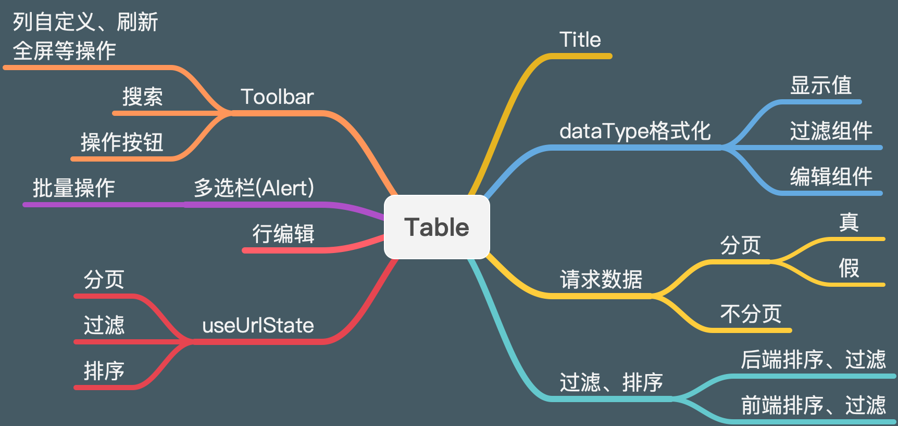

# Table

## 功能图谱



## 基础用法

<code src="./demos/basic.tsx" />

## 远程加载数据

<code src="./demos/request.tsx" />

## 选择和操作

<code src="./demos/selection.tsx" />

## 筛选和排序

<code src="./demos/filter-sorter.tsx" />

## 行编辑

<code src="./demos/edit-row.tsx" />

## URL State

> 通过 url query 参数来存储分页、过滤、排序参数

<code src="./demos/url-state.tsx" />

## API

> 这里只列出与 antd table 不同的 api

| 属性 | 描述 | 类型 | 默认值 |
| --- | --- | --- | --- |
| request | 获取 `dataSource` 的方法 | `(params?: {pageSize: number;current: number;[key: string]: any;},sort,filter) => Promise<RequestData<T>>` | - |
| params | 用于 request 查询的多余参数，一旦变化会触发重新加载 | object | - | - |
| formatData | 对通过 `request` 获取的数据进行处理 | `(data: T[]) => T[]` | - |
| actionRef | Table action 的引用，便于自定义触发 | `React.MutableRefObject<ActionType>` \| `((actionRef: ActionType) => void)` | - |
| options | table 工具栏，设为 false 时不显示 | `{{ fullScreen: boolean \| function, reload: boolean \| function,setting: true,search: boolean\|{name: string} }}` | false |
| columnsStateMap | columns 的状态枚举 | `{[key: string]: { show:boolean, fixed: "right" \| "left"} }` | - |
| onColumnsStateChange | columns 状态发生改变 | `(props: {[key: string]: { show:boolean, fixed: "right" \| "left"} }) => void` | - |
| toolbar | 渲染工具栏 | `React.ReactNode[] \|(( action: UseFetchDataAction<T>, rows: { selectedRowKeys?: (string \| number)[]; selectedRows?: T[]; }) => React.ReactNode[])` | - |
| onLoad | 数据加载完成后触发,会多次触发 | `(dataSource: T[]) => void` | - |
| headerTitle | 左上角的 title | `React.ReactNode` | - |
| rowSelection | 与 antd 中基本相同，但支持选中后的工具栏渲染，[配置项](#rowSelection-定义) | `TableRowSelection<T> \| false` | - |
| onEditSave | 行编辑下 Form 的保存事件 | `(formValue: T, originalRecord: T, index: number) => Promise<any>` | - |
| padding | table 外包裹的 Card padding 样式 | `boolean` | true |
| urlState | 将分页、过滤、排序状态同步到 url query 中 | `boolean` | false |

### ActionRef 手动触发

有时我们要手动触发 table 的 reload 等操作，可以使用 actionRef。

```tsx | pure
interface ActionType {
  reload: (resetPageIndex?: boolean) => void;
  clearSelected: () => void;
  edit: (record: T) => void;
}

const ref = useRef<ActionType>();

<Table actionRef={ref} />;

// 刷新
ref.current.reload();

// 清空选中项
ref.current.clearSelected();

// 触发行编辑
ref.current.edit();
```

### Columns 列定义

| 属性 | 描述 | 类型 | 默认值 |
| --- | --- | --- | --- |
| dataIndex | 与 antd 中基本相同，但是只支持字符串和字符串数组 | `string \| string[]` | - |
| title | 与 antd 中基本相同，但是支持通过传入一个方法 | `ReactNode \| ((config: ColumnType<T>) => ReactNode)` | - |
| render | 类似 table 的 render，增加了第四个参数 action | `(text: React.ReactNode,record: T,index: number,action: UseFetchDataAction<RequestData<T>>) => React.ReactNode \| React.ReactNode[]` | - |
| dataType | 值的类型，[配置项](#datatype-类型) | `ColumnsDataType<T>` | 'text' |
| hideInTable | 在 Table 中不展示此列 | boolean | - |
| filters | 表头的筛选菜单项，当值为 true 时，自动使用 dataType 生成 | `boolean \| object[]` | false |
| editor | 行编辑参数，生成 Form 输入组件 | `boolean \| React.ReactNode \| (item: T) => React.ReactNode` | - |
| editorName | 行编辑时 form name 属性，为空则取 dataIndex | `string \| string[]` | - |
| rules | 同 `Form.Item` 的 rules 属性 | `Rule[]` | - |

#### dataType 类型

封装了一些常用的值类型来减少重复的 `render` 操作，配置一个`dataType` 即可展示格式化响应的数据。

现在支持的值如下

| 类型 | 描述 | 示例 |
| --- | --- | --- |
| currency | 转化值为金额 | 10,000.26 |
| date | 日期 | 2019-11-16 |
| dateRange | 日期区间 | 2019-11-16 2019-11-18 |
| dateTime | 日期和时间 | 2019-11-16 12:50:00 |
| dateTimeRange | 日期和时间区间 | 2019-11-16 12:50:00 2019-11-18 12:50:00 |
| option | 操作项，会自动增加 marginRight，只支持一个数组,表单中会自动忽略 | `[<a>操作a</a>,<a>操作b</a>]` |
| text | 默认值，不做任何处理 | - |
| textarea | 与 text 相同， form 转化时会转为 textarea 组件 | - |
| percent | 百分比 | 12.1% |
| number | 数字 | 11.1 |
| enum | 枚举，form 转化时会转为 select 组件 | - |

##### 枚举

```tsx |pure
const columns = {
  title: 'Enum',
  dataIndex: 'enum',
  dataType: {
    type: 'enum',
    values: ['0': '值1','1': '值2'],
  },
};
```

##### 操作项

```tsx |pure
const columns = {
  title: 'Option',
  dataIndex: 'option',
  dataType: [<Button key={0}>操作1</Button>, <Button key={1}>操作2</Button>],
};

const columns = {
  title: 'Option',
  dataIndex: 'option',
  dataType: (record) => [<Button key={0}>操作1</Button>, <Button key={1}>操作2</Button>],
};
```

##### 传入 function

```tsx |pure
const columns = {
  title: 'currency',
  dataIndex: 'currency',
  dataType: (record) => (typeof record.type === 'number' ? 'number' : 'text'),
};
```

### rowSelection 定义

| 属性 | 描述 | 类型 | 默认值 |
| --- | --- | --- | --- |
| alertRender | 渲染选中后的提示栏,`false` 即可关闭 | `((props: { selectedRowKeys: (string \| number)[]; selectedRows: T[] }) => React.ReactNode)` \| `false` | - |
| alertOptionRender | 渲染选中后的操作栏,`false` 即可关闭 | `((props: { onCleanSelected: () => void }) => React.ReactNode)` \| `false` | - |
